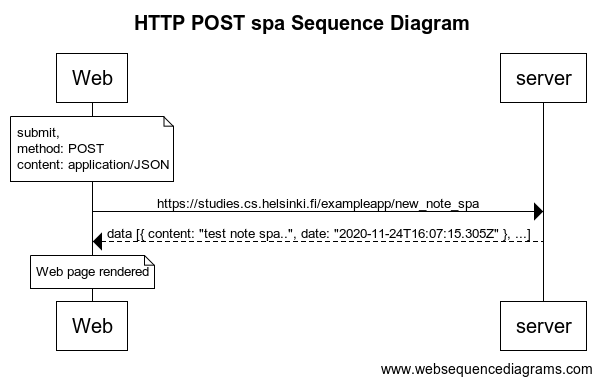

# SPA Post data

TITLE SPA Post Sequence Diagram

note over Web:
submit,
content: application/JSON
method: POST
end note

Web->server: `https://studies.cs.helsinki.fi/exampleapp/new_note_spa`
server-->Web: data [{ content: "test note spa..", date: "2020-11-24T16:07:15.305Z" }, ...]

note over Web:
Web page rendered
end note

